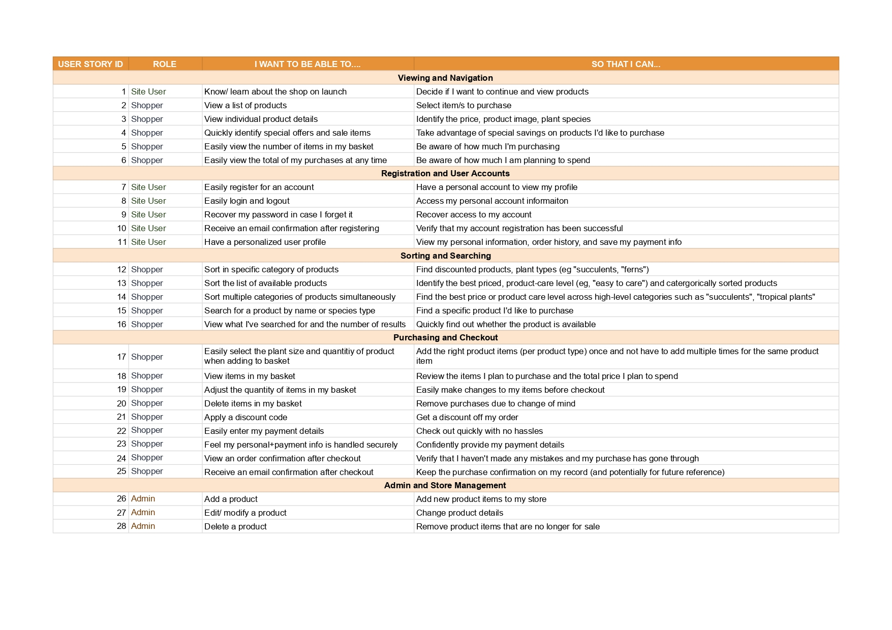
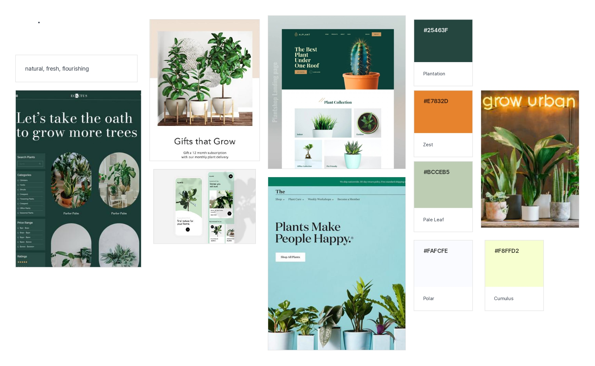
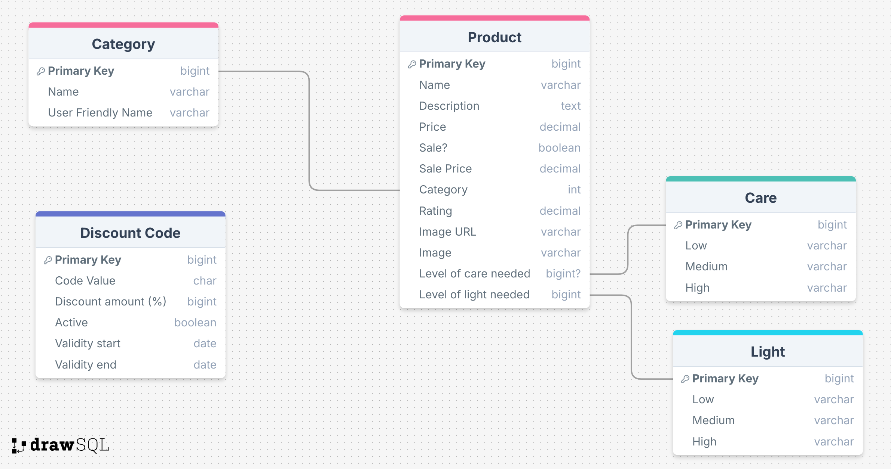

# Project Overview

Welcome,

This is Hygge Houseplants e-commerce website, a full-stack (Django) site for plant lovers to shop plants for their homes. They will also be able to view what movies other members have been watching. This is Rachel Luke's submission for Code Institute's Fullstacks Frameworks with Django (i.e., Milestone 4).

The following are high-level details of this project:

- This is a Django project backend using a relational database that allows users to store and manipulate data entries (i.e., their plant product purchases).
- The main technologies used are HTML, CSS, JavaScript, Python+Django, PostgreSQL and Stripe Payments.
- User functionality is intuitive to users (to create, locate, display, edit and delete records).
- The site has a main navigation in the header and a structured layout.
- Git & GitHub are used for version control.
- Any external code sources used in the project are clearly identified in the code itself and in this README.md file
- The final version has been deployed via GitHub Pages.
- There are no passwords or secret keys in the project repository.

The last update to this file was: **February 22nd, 2025**

\
 &nbsp;

# Table of Contents

- [Hygge Houseplants](#hygge-houseplants)
- [Project Overview](#project-overview)
- [Table of Contents](#table-of-contents)
- [UX](#ux)
  - [User Stories](#user-goals-stories)
- [UI / Design Choices](#ui-design-choices)
  - [Moodboard](#moodboard)
  - [Fonts](#fonts)
  - [Icons](#icons)
  - [Wireframes](#wireframes)
  - [Mockups](#mockups)
- [Technologies used](#technologies-used)
  - [Languages](#languages)
  - [IDE](#ide)
  - [Libraries & Framework](#libraries-framework)
  - [Tools](#tools)
- [Relational Database Management](#relational-database-management)
  - [Model Plan](#model-plan)
  - [Models](#models)
- [Features](#features)
  - [Existing Features](#existing-features)
  - [Future Features - to be implemented](#future-features)
- [Validating](#validating)
- [Testing](#testing)
  - [Testing User Stories](#testing-user-stories)
  - [Django Tests](#django-tests)
  - [Debugging](#debugging)
  - [Unfixed bugs](#unfixed-bugs)
- [Deployment](#deployment)
  - [Heroku](#heroku)
  - [How to Run this Project Locally](#how-to-run-this-project-locally)
  - [Settings Python File](#settings-python-file)
  - [Differences of Running Project in Heroku vs Locally](#differences-of-running-project-in-heroku-vs-locally)
- [Credits](#credits)
  - [External Code Sources](#external-code-sources)
  - [Special Thanks](#special-thanks)

\
 &nbsp;

# UX

## User Stories

At the planning stage of this project, stories for three roles: Site User, Shopper and Admin were created.
These stories are grouped within 5 stages: (1) Viewing and Navigation, (2) Registration and User Accounts, (3) Sorting and Searching, (4) Purchasing and Checkout, and (5) Admin and Store Management.

Below, is a screenshot of the spreadsheet listing the Site User, Shopper and Admin stories:

\
&nbsp;
[Back to Top](#table-of-contents)
\
&nbsp;

# UI / Design Choices

## Moodboard and Colour Palette

One of the first milestones of this project was to create a moodboard to help envision the overall house style of the website and ensure that all of the sections and elements are cohesive. The software I used to create the moodboard for this website is [Mila Note](https://milanote.com/ "Mila Note"). It also contains the hex codes of the chosen colour palette.

Below, is the moodboard and colour palette:

## Fonts

- In order to engender an aestetic website, and move away from the basic fonts available, I have used [Google Fonts](https://fonts.google.com/ "Google Fonts") to find a text that best suits the feel of the website.
- For the page headers, I decided to use [Gelasio](https://fonts.google.com/specimen/Gelasio "Gelasio font"). This font stands out of the fresh and clean looks and contrasts with the other sans serif fonts.
- For the header navigation links, along with the logo, I have chosen [Figtree](https://fonts.google.com/specimen/Figtree "Figtree") as this sans-serif font reads cleanly for both lower and upper cases.
- For the body text, [Hind](https://fonts.google.com/specimen/Hind "Hind") as it is clear to read and it is minimalistic.

Additional Notes:

- I have intentionally imported the fonts in the css file and not the html files as it saved some space in the html file and as this is a static website, the slightly longer loading time is not critical.

- Backup fonts (sans-serif) have been put in place as a safety net, in case the custom fonts used are not available.

- There is a 'double reset' in the css file. It simplifies calculate rem unit as I no longer need to think in scale factor of 1.6 but 10 instead.

## Icons

During testing, the console indicated that an icon from Favicon was required as the 'logo' symbol for the browser tab. As a fitting icon, I downloaded and incoporated the film icon from [Favicon](https://favicon.io/ "Favicon").

## Breakpoints

As a starting point, I will be building my website with a mobile first mindset using the iPhone 5/SE (320px) as the smallest screen size for styling to look good on. The screen size breakpoints that I will be using are from [Bootstrap breakpoints](https://getbootstrap.com/docs/5.0/layout/breakpoints/ "Bootstrap").

| Screen Size | Class Infix | Breakpoint |
| ----------- | ----------- | ---------- |
| x-small     | none        | <576px     |
| small       | sm          | => 576px   |
| medium      | md          | => 768px   |
| large       | lg          | => 992px   |
| x-large     | xl          | => 1200px  |

\
&nbsp;
[Back to Top](#table-of-contents)
\

## Wireframes

I have used [Balsamiq](https://balsamiq.com/wireframes/ "Balsamiq") to develop my wireframes for my website. I initially created the mobile version and then the wireframes and then scaled it up for desktop. The website has 3 pages that are all scrollable and displays/hides sections with logic in lieu of having even more HTML pages to decrease inconvenient reloading of entire website.

The wireframes are below:

I have used [Balsamiq](https://balsamiq.com/wireframes/ "Balsamiq") to develop my wireframes for my website. I initially created the mobile version and then the wireframes and then scaled it up for desktop.

The wireframes are located below:

[Landing Page - Mobile & Desktop Wireframes](static/docs/wireframes/wireframe-landing-mobile-desktop.png "home mobile and desktop wireframes")

[Product Page - Mobile & Desktop Wireframes](static/docs/wireframes/wireframe-product-mobile-desktop.png "product mobile and desktop wireframes")

[Single Product Page - Mobile & Desktop Wireframes](static/docs/wireframes/wireframe-product-focus-mobile-desktop.png "single product mobile and desktop wireframes")

[Basket Page - Mobile & Desktop Wireframes](static/docs/wireframes/wireframe-basket-mobile-desktop.png "basket mobile and desktop wireframes")

[Checkout Page - Mobile & Desktop Wireframes](static/docs/wireframes/wireframe-checkout-mobile-desktop.png "checkout mobile and desktop wireframes")

[Authentication Page - Mobile & Desktop Wireframes](static/docs/wireframes/wireframe-authentication-mobile-desktop.png "authentication mobile and desktop wireframes")

[Account Page - Mobile & Desktop Wireframes](static/docs/wireframes/wireframe-account-mobile-desktop.png "account mobile and desktop wireframes")

\
&nbsp;
[Back to Top](#table-of-contents)
\
&nbsp;

## Mockups

Based on the wireframes, I created mockups using [Figma](https://www.figma.com/ "Figma") to help me plan the interface design. Mockups for both mobile and desktop have been created as part of the website design phase, and can be viewed via this link [Mockups](https://www.figma.com/design/DhvQKsOvO6ar8RNbsWME8C/Project-4?node-id=0-11 "Mockups").

\
&nbsp;
[Back to Top](#table-of-contents)
\
&nbsp;

# Technologies used

## Languages

- [HTML](https://en.wikipedia.org/wiki/HTML "HTML")

- [CSS](https://en.wikipedia.org/wiki/CSS "CSS")

- [JavaScript](https://en.wikipedia.org/wiki/JavaScript "JavaScript")

- [Python](<https://en.wikipedia.org/wiki/Python_(programming_language)> "Python")

## IDE

- [GitPod](https://www.gitpod.io/ "GitPod")

## Libraries & Framework

- [Google Fonts](https://fonts.google.com/ "Google Fonts")

- [Font Awesome library](https://fontawesome.com/ "Font Awesome")

- [Favicon](https://favicon.io/ "Favicon")

- [Django](https://www.djangoproject.com/ "Django")

- [PostgreSQL](https://www.postgresql.org/ "PostgreSQL")

- [Bootstrap](https://getbootstrap.com/docs/4.6/getting-started/introduction/ "BootStrap 4")

## Tools

- [Mila Note](https://milanote.com/ "Mila Note")

- [Balsamiq](https://balsamiq.com/wireframes/ "Balsamiq")

- [CI Full Template](https://github.com/Code-Institute-Org/ci-full-template "CI Full Template")

- [Tables Generator](https://www.tablesgenerator.com/markdown_tables "Tables Generator")

- [DrawSQL](https://drawsql.app/ "DrawSQL")

- [TempMail](https://temp-mail.org/ "TempMail")

- [Cloudinary](https://cloudinary.com/ "Cloudinary")

- [Coverage](https://coverage.readthedocs.io/en/7.6.12/ "Coverage")

- [Whitenoise](https://whitenoise.readthedocs.io/en/stable/django.html "Whitenoise")

- [W3C HTML Validation Service](https://validator.w3.org/ "W3C HTML")

- [W3C CSS Validation Service](https://jigsaw.w3.org/css-validator/ "W3C CSS")

- [W3C JS Validation Service](https://jshint.com "JSHint JS")

- [Flake8](https://flake8.pycqa.org/en/latest/ "Flake8")

\
&nbsp;
[Back to Top](#table-of-contents)
\
&nbsp;

# Relational Database Management

## Model Plan

The first design phase of the database models was mapped out using [DrawSQL](https://drawsql.app/ "DrawSQL"), which is a database design tool for creating scheme diagrams. Below is the model plan designed with DrawSQL:

## Models - Product App

### Category Model

| Primary Key | Name             | User Friendly Name |
| ----------- | ---------------- | ------------------ |
| 1           | cacti_succulents | Cacti & Succulents |
| 2           | hanging_trailing | Hanging & Trailing |
| 3           | foliage_fern     | Foliage & Fern     |
| 4           | tropical         | Tropical           |

- This model contains the Category name (required field, returned by string method) and user friendly name.

- The Category name is also the field connects the Category Model and Product Model, where each Product object is connected with a Category name.

### Product Model

| Primary Key | Product Name     | Species                 | Description | Sale? | Price | Sale Price | Category | Rating | Image            | Image URL | Care Level | Light Level | Pet Friendly? |
| ----------- | ---------------- | ----------------------- | ----------- | ----- | ----- | ---------- | -------- | ------ | ---------------- | --------- | ---------- | ----------- | ------------- |
| 1           | Aloe Vera        | Aloe barbadensis miller |             | No    | 16.50 |            | 1        | 4.1    | aloevera.png     |           | 3          | 3           | No            |
| 2           | Golden Pothos    | Epipremnum aureum       |             | No    | 10.99 |            | 2        | 4.7    | goldenpothos.png |           | 2          | 1           | No            |
| 3           | Spider Plant     | Chlorophytum Comosum    |             | No    | 9.50  |            | 2        | 3.9    | spiderplant.jpg  |           | 1          | 2           | Yes           |
| 4           | Boston Fern      | Nephrolepis exaltata    |             | No    | 12.00 |            | 3        | 4.6    | bostonfern.png   |           | 2          | 2           | Yes           |
| 5           | Bird of Paradise | Strelitzia Nicolai      |             | Yes   | 18.99 |            | 4        | 4.2    | birdparadise.png |           | 1          | 3           | No            |
| 6           | Peace Lily       | Spathiphyllum wallisii  |             | Yes   | 12    | 10.50      | 4        | 4.8    | peacelily.png    |           | 3          | 1           | No            |

- This model returns the string Product Name.

- The required fields are Product Name, Description and Price.

- The Product ID is the primary key that is passed through for (all users) to add/modify/delete in bags and (for superusers) to edit/delete products.

### Plant Care Level Model

| Primary Key | Name        | User Friendly Name |
| ----------- | ----------- | ------------------ |
| 1           | low_care    | Unkillable         |
| 2           | medium_care | Easy to take care  |
| 3           | high_care   | Needs a lot of TLC |

- This model's fields are assigned to each Product object.

### Plant Light Level Model

| Primary Key | Name         | User Friendly Name |
| ----------- | ------------ | ------------------ |
| 1           | low_light    | Low Light          |
| 2           | medium_light | Medium Light       |
| 3           | high_light   | Bright Light       |

- This model's fields are assigned to each Product object.

### Discount Code Model

| Primary Key | Code          | Discount % | Description                | Active? | Validity Start Datetime | Validity End Datetime |
| ----------- | ------------- | ---------- | -------------------------- | ------- | ----------------------- | --------------------- |
| 1           | WELCOME15     | 15         | New Members Discount       | Yes     | 01/04/2024 00:00:00     | 01/04/2025 00:00:00   |
| 2           | pRL29Akc04    | 10         | Student Discount           | Yes     | 11/12/2024 00:00:00     | 11/02/2024 00:00:00   |
| 3           | BLACKFRIYAY25 | 25         | Black Friday 2024 Discount | No      | 28/11/2024 00:00:00     | 30/11/2024 00:00:00   |

- This model contains the Discount Code (required field, returned by string method) and Discount%, Discription (required), Active?, Validity Start (required field), Validity End (required field)

## Models - Profiles App

### UserProfile Model

| User | Phone Number | Country        | Street Address 1 | Street Address 2 | Town or City | County    | Postcode |
| ---- | ------------ | -------------- | ---------------- | ---------------- | ------------ | --------- | -------- |
| rL07 | 383920239    | United Kingdom | 23 Clark Suites  | Merridian Way    | Manchester   | Stockport | MA7 6NF  |

- This user profile model is for maintaining default delivery information and order history (cascaded through to Order Model by User field).

## Models - Checkout App

### Order Model

| Order Number                     | User Profile | Date                      | Full Name | Email            | Phone Number | Country        | Postcode | Town or City | Street Address 1 | Street Address 2 | County     | Delivery Cost | Order Total | Grand Total | Original Bag | Stripe PID                  |
| -------------------------------- | ------------ | ------------------------- | --------- | ---------------- | ------------ | -------------- | -------- | ------------ | ---------------- | ---------------- | ---------- | ------------- | ----------- | ----------- | ------------ | --------------------------- |
| FF682CD74CF448A9A3B7E58F6BAFF3D5 | rL07         | Feb. 21, 2025, 10:54 a.m. | Betsy     | betsy6@gmail.com | 5673255      | United Kingdom | MA7 6NF  | Stockport    | 23 Clark Suites  | Merridian Way    | Manchester | 0.00          | 49.50       | 49.50       | {"9": 3}     | pi_3QutrxF9uUBrkCny2Tgvv7ke |
|                                  |              |                           |           |                  |              |                |          |              |                  |                  |            |               |             |             |              |                             |
|                                  |              |                           |           |                  |              |                |          |              |                  |                  |            |               |             |             |              |                             |

- This model contains the Order Number (random generated 32-bit string), User Profile (username field cascaded from the UserProfile model), Date (date+time), Full Name (required), Email (required), Phone Number (required), Country (required, drop-down select), Postcode, Town or City (required), Street Address 1 (required), Street Address 2, County, Delivery Cost (read-only), Order total (read-only), Grand total (read-only), Original bag (product pk: quantity) and Stripe PID (read-only).

### OrderLineItem Model

| Product   | Quantity | Line Item Total | Delete? |
| --------- | -------- | --------------- | ------- |
| Aloe Vera | 3        | 49.50           | False   |

- This model is linked with the Order Model (the order number gets cascaded).

- The fields are Product (product name), quantity, line item total (read-only), delete? (boolean).

- This model enables admin to be able to adjust a customer's order if required post-order.

\
&nbsp;
[Back to Top](#table-of-contents)
\
&nbsp;

# Features

## Existing Features

### Header (Navigation Bar)

- The `base.html` (which is extended by all html files), is where the header layout is situated (at the top).
- This contains an interactable logo, which conveniently redirects the user back to the Home page (`index.html`). The 'Home' button also does this.
- The 'Shop' navigation link has a drop-down list where the user can select whether they wish to view all products or shop by categories. This is to enhance the user's experience and to expedite their search.
  - 
- The 'Contact' navigation link opens a new tab to the company's Facebook page in case they would like to contact the company for any questions/ issues around orders.
- When the navigation links are hovered, they change font colour to white to indicate they are interactive.
- The search bar is functional and will be further discussed in the Product Page section. This feature allows for the user to directly search for a product if they do not see it immediately.
- The user icon and bag icon are UI-friendly and when hovered turn less opaque to indicate they are interactive. If a user is not currently logged in, when the icon is clicked on there will be a drop-down list to 'Register' or 'Login'. More functionality (profile and bag) will be elaborated on in succeeding sections.
- Within the header, below the navigation bar, is the 'announcements' banner. This is where the shop owner can display announcements or engage with the customer with promotions or incentive. The striking colours are to help catch the shoppers' eye.

### Home Page

- The Home Page (`index.html`) consists of three sections.

- Home Section 1 - Shop All

  - 
  - The button directs users to the all products page and when hovered has its colours inverted (within the projects' colour scheme) to entice the users to click.

- Home Section 2 - Shop By Collection

  - 
  - The users gain more insight into what type of plants are sold and can conveniently choose which type they fancy on shopping.
  - The section images are handled by Bootstrap/css configuration to adapt to media queries.
  - 

- Home Section 3 - About Us
  - 
  - This section informs/ encourages the users to shop on this website, providing positive insight and context of the Hygge Houseplants company and their virtues.
  - Once again, this is handled with Bootstrap/css to fit according to device sizes.

\
&nbsp;
[Back to Top](#table-of-contents)
\
&nbsp;

### Profile Page

- The Profile Page essentially has two components: (1) Delivery address form and (2) Order History.
- The delivery address form allows users to input their address details so that it is automatically stored and filled out at checkout (which expedites the shopping experience for the user).
- The Order History table is a useful reference point for the customer to be able to review and refer to their shopping orders and their respective dates/times, and order total.

### Products Page

- The Products page (`products.html`) is where users can browse/shop all the products.

- The page has a clear title on top, with category badges below for the users to easily filter the category of products.

- When a user clicks on a Category badge, they will also have an option to view 'All Products again'

  - 

- The number of products displayed on the page is indicated to the users on the top left (so they are aware of how many they can expect to browse through).

- When a user searches a term in the search bar (in the header), the results (if any) will be displayed within the Products page. An example of this is exhibited below.

  - 

- On the right hand side, is where the Sort drop-down feature is positioned. When clicked on, a drop-down list is shown (which can be closed once clicked outside). This sort feature is for the customers to customise the ordering of the products being shown by rating and price (high to low or vice-versa). This is handy for users for when there are a lot of products to browse through and they can prioritise which products to view.

  - 

- At the bottom right, there is a scroll up feature, where the user can conveniently pop all the way back up immediately. This will be a useful feature, when there are many products available and the user does not want to scroll a long way back up.

  - 

- If a product has a sale price, this is displayed as the default price and the 'original' price is formatted to be striked-through. This is intentional to encourage the shoppers to buy the product as they can see the difference of prices. This feature is also applied to the individual products' page.

  - 

- Each product cards have the respective product's image, name, price, rating (if any), and if the user is an admin (i.e., superuser) they also have features to edit/delete the item, as shown below.

  - 

- The 'Edit' link will direct the superuser to a the respective products' form where they can edit the fields.

- The 'Delete' link will delete the Product and this action will be confirmed by a toast message.

- Only superusers have the ability to modify, and even if a 'normal' user attempts to type in the URL to edit/delete/add a product, they will not be able to.

- To add a product, a superuser (once logged in) can either enter at the end of the URL `/products/add` or click on the user icon and go to 'Product Management'. Below is a screenshot of a superadmin adding a product using the Product Management form.
  - 
- Once the superadmin has correctly and successfully submitted the 'Add Product' form, they will be directed to the new product's info page and there will also be a success toast message for confirmation.
  - 

### Products - Individual Page

- The invidiual product page (`products-info.html`) is where the user can view more details on their selected product. If they are a superuser, they will also be able to edit/delete the product via this view as well.

- Depending on the products' corresponding data, if they are pet-friendly, this attribute will dynamically be listed under the product's description. Along with the associated Light and Care level, these attributes have a short description next to a user-friendly icon.

  - 

- At the bottom left, there is a 'Keep Shopping' button to redirect the user to the 'All Products' page if they wish to return.

- The shopper is able to modify the quantity they wish to add to their bag. There is logic in place (in `quantity_input_script.html`) so that they are only allowed to have within a range of 1-10 of the individual product in their bag. A validation message will pop up if otherwise, and the request won't be added to the user's bag.

  - 

- Once the shopper has added a product to their bag, a success toast appears which displays a bag preview (with the total price) and also allows the user to view their bag.
  - 

### Bag

- A user can easily view their bag (via the navigation header or add to bag success toast message).
- If the user has not reached the minimum requirement for free delivery (set by the shop owner), the delta needed will be displayed to the user. This is also to incentivize shoppers to purchase more to be 'rewarded' free delivery.
  - 
- This is also reinforced with success toast messages, as shown below.
  - 
- Within their bag, the user is able to modify the quantity or completely remove the item.
- If item is removed, there will be a success message and the user is able to redirect back to the shopping page via the 'Keep Shopping' button.
  - 
- Only when a user has an item in their bag, are they able to proceed with 'checkout'.

### Checkout

- Shoppers who have not logged in yet, will view the links below the Delivery Form to quickly 'Create an account' or 'Login'. Users who have logged in and have Delivery information saved within their profile, will conveniently have their delivery information filled in automatically at the Checkout page.

- The Delivery Form has its own validation and the required fields are indicated with asterisks.
- Next to the Delivery Form is the Order Summary, where the product's image, quantity, price and subtotal are calculated and displayed.
- At the bottom of the checkout page, the user can enter their payment details (and since this is using Stripe, they may also be able to save their card details depending on their browser).
- Next to the 'Complete Order' button, there is an 'Adjust Bag', which is a convenient navigation link for the users to go back to modify the bag if required after viewing the Order Summary.
- Stripe authentication and webhooks are in place and used for card payments, and to handle card authentication if required.
  - 
- While the payment is being authenticated, there is a loading page with animation to indicate to the user that the transaction is occurring.
- 
- This order will also be available in the user's Order History (in their Profile).
- If the checkout transaction is successful, the user will be directed to an order confirmation page, along with a success toast. An example of this is displayed below.
  - 
- Below this order confirmation, there is a 'Back to Shopping' button to redirect the users to shop again.

\
&nbsp;
[Back to Top](#table-of-contents)
\
&nbsp;

### Footer

- The `base.html` (which is extended by all html files), is where the footer is situated (at the bottom).
- The footer contains a copyright and also the company's social media outlets. Each of the social media icons are interactable (as the users' mouse converts from an arrow pointer to touch one when it hovers). When clicked, a new tab is opened (for security reasons) and directs the user to the respective social media page.

### Accessibility

- URL configurations that can be entered/edited by the user (configured in the modules' `urls.py`), intentionally have dashes (-) and not underscores (\_) for ease of input.

- All images have `alt` attributes to provide an alternative, screen-reader friendly text description.

\
&nbsp;
[Back to Top](#table-of-contents)
\
&nbsp;

## Future Features

- Product Filters

  - In addition to the existing 'sort drop-down' feature, a Product Filter could be added to the Products page (`product.html`). This was initially planned in the wireframes however due to the a foreign key issue complicating the query between models, the plant product's 'Care', 'Light' and 'Pet-friendly?' attributes are visible in the respective products' information page (`product_info.html`).

- Contact Form

  - Instead of the current logic where the 'Contact' in the Navigation Header opens up a new tab directing to a Facebook page, a better, improved communication platform would be to have a Contact Form. The user would be able to submit a message along with their email and this would go directly to the company. They would also get a confirmation email that their message has been submitted.

- Footer - Subscription to Newsletter

  - The footer is rather simple and could be fleshed out with more features like a subscription form, where users can sign up to a newsletter/ marketing emails and potentially as incentive could get a one-off 10% Discount for signing up.

- Discount Codes - Checkout

  - There is currently a Discounts model (in Products model) that is not being used. This should be used in the future, where only active, valid discount codes within the model can be authenticated and applied to users' checkout bags.

- Returns & Refunds

  - A typical component of e-commerce websites are a 'Returns & Refunds' form/ section within the User Profile. This could be a future implementation to improve the users' experience instead of having to send a message via Facebook to the company.

- Complete any outstanding [user stories](#testing-user-stories)

\
&nbsp;
[Back to Top](#table-of-contents)
\
&nbsp;

# Validating

## HTML Validator Results

- Using the w3 validator, any and all HTML errors/warnings were to do around passing variables around in the Django templates, which are required in this project. An example of this is included below.
  - HTML validator results (of index.html) [results](/static/docs/validator/html-validator-index.png "W3 HTML")

## CSS Validator Results

- No errors were present in the validation of base.css, profile.css and checkout.css files. An example of the results is included below.
  - CSS validator results (of base.css) [results](/static/docs/validator/css-validator-base.png "W3C CSS")

## JS Validator Results

- Essentially most of the warnings from JSHint Validator were to do with the ESVersion and not the syntax. A missing semicolon was added and unnecessary semicolon was removed to resolve two warnings. Results of the validation of countryfield.js and stripe_elements.js are located below.
  - JS validator results (of countryfield.js) [results](/static/docs/validator/js-validator-countryfield.png "JSHint JS")
  - JS validator results (of stripe_elements.js) [results](/static/docs/validator/js-validator-stripe.png "JSHint JS")

## Python Flake8 Results

- Within the VSCode Project, Flake8, an in-built extension, a Python Flake8 Checker was used.
- Styling errors were discovered and resolved; these include the following:
  - Add spaces after commas in lists
  - Break up long lines
  - Remove trailing whitespace
  - Adding new lines at the end of a file
  - Ensure two blank lines to separate classes and functions

\
&nbsp;
[Back to Top](#table-of-contents)
\
&nbsp;

# Testing

## Testing User Stories

As there is a total of 28 stories (listed precedingly), the testing results of the [stories](#user-stories) will be explored by their categories (e.g., 'Viewing and Navigation', 'Registration and User Accounts'). Refer to the user story IDs in the original story spreadsheet to their corresponding testing results below.

### Stories - Viewing and Navigation

1. DONE - As the site user enters the website for the first time, the logo, appearance of the first two launch sections, clarify the purpose of this plants e-commerce website. [View outcome.](static/docs/stories/story-1.png "story 1 outcome")

2. DONE - There are multiple points in the launch page, where the shopper can view a list of products: 'Shop' in navigation header, 'SHOP ALL INDOOR PLANTS' button in first home page section and 'Shop by Category' with four different plant categories in the second home page section. [View outcome.](static/docs/stories/story-2.png "story 2 outcome")

3. DONE - Shoppers can click on product cards to view their individual details, which include the product name, price (and sale price if applicable), description and attributes (care requirement level, light requirement level + if it is pet-friendly). [View outcome.](static/docs/stories/story-3.png "story 3 outcome")

4. IN PROGRESS - Sale prices are shown but there could be a special category for items on sales within the 'Shop' drop down list to improve this experience. [View outcome.](static/docs/stories/story-4.png "story 4 outcome")

5. DONE - Shoppers can view the number of items in their bag throughout the website by referring to the bag icon in the header. [View outcome.](static/docs/stories/story-5.png "story 5 outcome")

6. DONE - Shoppers can quickly view their bag total when adding items to their bag within the success toasts and also by clicking the basket. [View outcome.](static/docs/stories/story-5.png "story 6 outcome")

### Stories - Registration and Accounts

7. DONE - New users can register an account and offered to do so in multiple locations: Clicking on the user icon and then choosing 'Register', if they accidentally click 'Login' there is also an option to 'Sign up', at checkout if they have not logged in, there is an option to 'Create a New Account'. [View outcome.](static/docs/stories/story-7.png "story 7 outcome")

8. DONE - Users can easily login and logout of their account as there is a conveniently located user icon in the header, with these features. [View outcome.](static/docs/stories/story-7.png "story 8 outcome")

9. OPEN - Due to server issues regarding real emails being sent, password verification currently has to be done with users contacting the store admin to reset their password (in Django backend).

10. IN PROGRESS - Due to server issues regarding real emails being sent, after account registration, the user is logged in automatically and a success toast message is displayed with the confirmation. It should be noted that new users may not be successfully registered if their passwords do not match the stated criteria. [View outcome.](static/docs/stories/story-10.png "story 10 outcome")

11. IN PROGRESS - Site users have their own profile which they can customize their Delivery Address and view their Order History. Currently, site users are not able to save their payment info. [View outcome.](static/docs/stories/story-11.png "story 11 outcome")

### Stories - Sorting and Searching

12. DONE - Shoppers can shop products in specific categories (which is done easily via navigation header 'Shop', in the second section of Launch page and also via the category badges on the Products page). [View outcome.](static/docs/stories/story-12.png "story 12 outcome")

13. DONE - Shoppers can sort all of products by rating or price. [View outcome.](static/docs/stories/story-13.png "story 13 outcome")

14. DONE - Shoppers can sort categorized products by rating or price. [View outcome.](static/docs/stories/story-14.png "story 14 outcome")

15. DONE - Shoppers can utilize the search bar located in the header for specific products they would like to purchase. [View outcome.](static/docs/stories/story-15.png "story 15 outcome")

16. DONE - The search outcome includes the number of products 'matched' the user's query. [View outcome.](static/docs/stories/story-15.png "story 16 outcome")

### Stories - Purchasing and Checkout

17. DONE - Quantity can be added and modified to the shopper's bag. It should be noted that the scope of the project has been simplified, hence plant sizes as specified in the story are not included within this project. [View outcome.](static/docs/stories/story-17.png "story 17 outcome")

18. DONE - Shoppers can click on the bag icon and view success toasts' previews to quickly view items in their bag. [View outcome.](static/docs/stories/story-18.png "story 18 outcome")

19. DONE - Shoppers can easily increase or decrease the quantity of a specific item in their bag (as long as it is within the range 1-10). [View outcome.](static/docs/stories/story-19.png "story 19 outcome")

20. DONE - Shoppers can remove a specific item from their bag within their bag view. [View outcome.](static/docs/stories/story-20.png "story 20 outcome")

21. OPEN - Shoppers currently cannot apply a discount code. This has been included in Future Features to be implemented, discussed in [Unfixed Bugs](#unfixed-bugs).

22. DONE - Within the checkout view, shoppers can add their payment details and if they have their delivery information saved to their profile, this is automatically filled out at checkout (if the user is logged in). [View outcome.](static/docs/stories/story-22.png "story 22 outcome")

23. DONE - Stripe JS and validation is being used for payment handling, ensuring the security of payment transaction to the user.

24. DONE - Shoppers are immediately directed to the Order Confirmation after a successful transaction, a success toast is displayed to them and they can also view their order within their Order History (via their Profile). [View outcome.](static/docs/stories/story-24.png "story 24 outcome")

25. OPEN - Due to server issues regarding real emails being sent, discussed in [Unfixed Bugs](#unfixed-bugs).

### Stories - Admin and Store Management

26. DONE - Store admin can add a product via 'Product Management' in the User Icon drop-down list (only available to logged-in superusers) or by directly adding `/products/add` after relevant URL. A success toast message is also displayed as a confirmation. [View outcome.](static/docs/stories/story-26.png "story 26 outcome")

27. DONE - Store admin can edit/modify products (only when logged in as a superuser), in both the products or individual products' page views. An alert toast will also confirm that the product is being modified. [View outcome.](static/docs/stories/story-27.png "story 27 outcome")

28. DONE - Store admin can delete products (only when logged in as a superuser), in both the products or individual products' page views. A success toast message is also displayed as a confirmation. [View outcome.](static/docs/stories/story-28.png "story 28 outcome")

\
&nbsp;
[Back to Top](#table-of-contents)
\
&nbsp;

## Django Tests

In addition to manual tests of the user stories, automated Django unit testings were conducted within this Hygge Houseplants project. Each unit test isolate and a specific function with a result of one of the following: `.` (Success), `E` (Error) and `F` (Fail).

Each module within this project (which include: bag, checkout, home, products + profiles) has its own `tests.py` file. Within each file, there are tests for Forms, Views and Models (where applicable).
To conduct the Django tests within your local build, refer to the respective module's test.py file.
For example, if you wanted to test the Products (module) tests within this project, run the following command in your terminal: `python manage.py test products.tests`

### Django Test Coverage

A tool called 'Coverage' has been installed and used to check and create reports on the Django tests coverage over the project. A few iterations have already been done, for example within the Products module, the coverage was initially 74% but was improved to 76% after more Model tests were added to check on the string return methods. Screenshots of these reports are shown below.

- 
- 
  For future development, all of the modules' test files should be worked on further to improve the overall coverage percentage.

\
&nbsp;
[Back to Top](#table-of-contents)
\
&nbsp;

## Debugging

- The following entail the key debugging moments during the project, some of which were logged in the 'Issues' within this project's GitHub repository.

- JSQuery Import

  - Using the Browser Inspector, there was an error `Uncaught ReferenceError: $ is not defined` as shown in screenshot below. The root of the issue was the the JSQuery import was not being properly loaded, hence a new JSQuery import link was used in `base.html` which resolved this issue.
  - 

- Bootstrap (CSS Styling)

  - In the earlier/ initial versions of the project, HTML containers, sections and pages required heavy padding/ margin positioning. To refine the styling process, Bootstrap was introduced to alleviate media query styling.
  - Two rounds of reiterations of CSS styling were done, the latter to minimize CSS file usage with Bootstrap class modifications and also to ensure that the following priorities were in place:
    - Bootstrap hierachy: container > row > col > content
    - Bootstrap cols: col > sm > md > lg
  - Once these changes were made, this had a positive impact on the CSS efforts/ performance.

- Checkout View

  - There was a logged bug (Issue #40) where the user would checkout, which resulted in the stripe loading page then back to the checkout page, and not the order confirmation page as expected. There was no success toast either.
  - My stripe dashboard confirmed that the transaction start but was 'incomplete'. Hence, by using the webhooks and Stripe CLI, it was evinced that there was an error with the `cache_checkout_data` view. Once the respective path in `urls.py (checkout)` was corrected the Stripe payment was successful and the order confirmation page was shown as expected.

## Unfixed Bugs

- Profile Page

  - There is a white blank space after the footer (only in larger devices).
  - The Order History's scroll is too close to the edge.
  - 

- Products Page

  - When a user's search query has 0 results, the outcome (i.e., Products Page) has a white blank space below the footer.
  - This bug is only for larger devices.
  - 

- UI - Adding Products to Bag

  - When a customer adds a product to their bag, the number of bagged products is shown on the bag icon (in top header).
  - This currently makes the bag icon drop slightly down compared to the other header items.
  - 

- Chrome Extensions

  - Using the Browser Inspector, there were two errors: `Unchecked runtime.lastError: The page keeping the extension port is moved into back/forward cache, so the message channel is closed.` and the other error located in the screenshot below. These 'errors' were discovered to be due to chrome extensions, and do not appear in incognito browsers however.
  - 

- Real Email Communication

  - Throughout the project, when an email is communicated to be sent to the user, this does not happen.
  - This is due to an on-going server issue faced by other MS4 Students as well outlined in the slack channels.
  - In lieu of real emails, toasts notify the user when they have been signed in/ registered and email verifications are disabled in settings.py. Also, for order confirmations, users can check their profile's order history.
  - For a user's password recovery, an admin (i.e., superuser) would have to do this manually via Django admin.

\
&nbsp;
[Back to Top](#table-of-contents)
\
&nbsp;

# Deployment

## Heroku

This project was deployed via Heroku, using the following steps:

1. Log in Heroku website, create a new app
2. Go to Settings and add the following Config Vars:

- DATABASE_URL: Enter Postgres URL postgres://EXAMPLE-POSTGRES-URL
- IP: 0.0.0.0
- PORT: 5000
- SECRET_KEY: XXXX
- CLOUDINARY_URL: cloudinary://XXX
- CL_API_KEY: XXX
- CL_SECRET: XXX
- DEBUG: TRUE (before launch, change to FALSE)
- DEVELOPMENT: TRUE (before launch, change to FALSE)
- DISABLE_COLLECTSTATIC: 1
- EMAIL_HOST_PASS: XXX
- EMAIL_HOST_USER: XXX@X.COM
- STRIPE_PUBLIC_KEY: pk_test_XXX
- STRIPE_SECRET_KEY: sk_test_XXX
- STRIPE_WH_SECRET: whsec_XXX

3. In the 'Deployment method' section, connect to GitHub (and also Enable Automatic Deploys).
4. Run in console: (`python3`)
5. In console, import Postgres database: (`from hygge_houseplants import db`) and then (`db.create_all()`).
6. Deploy the website. This link is [Hygge Houseplants - Heroku](https://ms4-hygge-houseplants-727aa19c949d.herokuapp.com/).
7. If any changes were required, they could be implemented, commited and pushed to GitHub and the changes would automatically be updated and deployed.

## How to Run this Project Locally

To work on this project within your local IDE such as VSCode, Pycharm etc:

1. Follow this link to the [Project GitHub repository](https://github.com/rachelcluke/hygge-houseplants "Project GitHub respository")
2. Under 'Code', copy the Clone URL for the repository.
3. In your local IDE, open a terminal.
4. Navigate into the desired working directory.
5. Type `git clone` and then paste the URL you copied in Step 2.
6. Hit Enter and your local clone will be created.
7. Within your project, in a terminal run `pip install -r /path/to/requirements.txt`.
8. Create an env.py file within the project folder and include the name of this file in your .gitignore file before committing.
9. Within your env.py file, add and modify the following:

   - `import os`
   - `os.environ["envpy_test"] = "envpy"`
   - `os.environ["DATABASE_URL"] = "postgresql://XXX"`
   - `os.environ["DEVELOPMENT"] = "TRUE"`
   - `os.environ["SECRET_KEY"] = "YOUR_SECRET_KEY`
   - `os.environ["EMAIL_HOST_USER"] = "YOUREMAIL@.COM"`
   - `os.environ["EMAIL_HOST_PASS"] = "EMAIL SECURITY PASS"`
   - `os.environ["STRIPE_PUBLIC_KEY"] "pk_test_XXX" `
   - `os.environ["STRIPE_SECRET_KEY"] = "sk_test_XXX" `
   - `os.environ["STRIPE_WH_SECRET"] = "whsec_XXX" `
   - `os.environ["CL_API_KEY"] = "XXX" `
   - `os.environ["CL_SECRET"] = "XXX"`
   - `os.environ["USE_CLOUDINARY"] = "TRUE"`

For further reference on cloning a respository from GitHub, click [here.](https://docs.github.com/en/repositories/creating-and-managing-repositories/cloning-a-repository "Cloning a repository")

For further reference on creating an email host pass, click [here.](https://help.referral-factory.com/en/articles/9782920-how-to-set-up-your-own-email-server-using-gmail "Set up Gmail server")

For further reference on creating a Stripe Keys, click [here.](https://docs.stripe.com/keys "Stripe Dev Documentation")

For further reference on creating and storing Cloudinary keys, click [here.](https://dev.to/spymonk/integrating-cloudinary-storage-with-django-4ipb "Cloudinary Integration")

## Settings Python File

- The settings.py located in the project root level, is where the key logic for the following aspects of this project is configured:

  - Imports and Django templates
  - Allowed Hosts and CSRF Trusted Origins
  - Installed Apps
  - Middleware
  - Django Password Authentication, Authentication Backends
  - Stripe API Keys, Currency, 'Free Delivery Threshold' and 'Standard Delivery Percentage'
  - Static vs Cloudinary Management (to be discussed further in next section)
  - NOTE: Any and all confidential keys/informations are stored in either the env.py (for local build, which does not get committed to the repo or for Heroku deployment, in the config vars)

## Differences of Running Project in Heroku vs Locally

- In the settings.py file, it is configured so that if the project is run locally, the static files stored in the 'static' folder (in project root level) is used. Elsewise, the Cloudinary management is used with the Cloudinary API secret keys. Also, in the Heroku app, Cloudinary is installed as an 'Add-On'.

- If 'Development' is set to true (in os.environ for local build), emails will be sent to terminal, else it is configured to use the Email Pass and send emails from the set Email Host.

- Gunicorn (wsgi) is set in settings.py for local build and in 'Resources' in Heroku.

&nbsp;
[Back to Top](#table-of-contents)
\
&nbsp;

# Credits

## External Code Sources

- Code Institute's [Project Boutique Ado](https://github.com/Code-Institute-Solutions/boutique_ado_v1/blob/a07c1ca5a3b973eb47e5c944829cea06ead3936d/templates/base.html "Project Ado") was utilised as a reference and the following files from this project have been used within this project:
  - stripe_elements.js
  - webhook_handler.py

## Special Thanks

For mentoring, code advising and project reviewing:

- [Simen Daehlin](https://github.com/Eventyret "Simen Daehlin")

For technical support and guidance:

- [Tutors at Code Institute](https://codeinstitute.net/blog/meet-our-support-teams/ "Code Institute Support")

For social media reference:

- [Plants and Papers Swansea](https://www.instagram.com/plantsandpapers/ "Plants and Papers")

For content and design inspiration:

- [Beards and Daisies](https://www.beardsanddaisies.co.uk/ "Beards and Daisies")

- [The Little Botanical](https://thelittlebotanical.com/ "The Little Botanical")

- [Quirky Plants](https://www.quirkyplants.co.uk/ "Quirky Plants")

\
&nbsp;

Finally, a big shoutout to my family, friends and loved ones for their unwavering encouragement and support.

---

\
&nbsp;

Thank you all, from Rachel Luke.

\
&nbsp;
[Back to Top](#table-of-contents)
